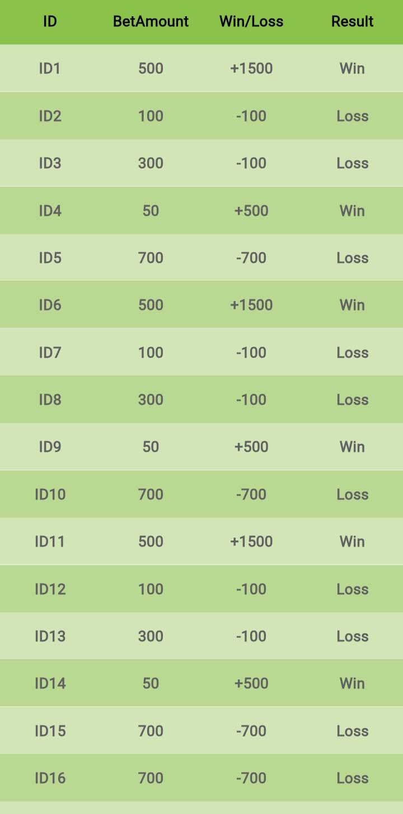

<!--
    Developer: Sikandar Ali Bhojawat
    Github: https://github.com/SikandarAliBhojawat
-->

Create a table in very easy way with simple and clean UI. and also customize it easily.

## Table Example




## 🚀 Features

- **🎨 Beautiful UI**: Create stunning tables with ease, thanks to a sleek and modern design.

- **🛠 Clean Code**: Write maintainable code effortlessly, as StylishTable encourages clean and readable code practices.

- **🚀 Easy Integration**: Quickly integrate stylish tables into your Flutter applications with minimal setup.

- **🌐 Responsive Design**: Ensure a seamless user experience across different screen sizes, making your tables look great on any device.

- **🎨 Customization**: Tailor the look and feel of your tables using a variety of styling options, including colors, fonts, and borders.

## 📦 Installation

Add the following to your `pubspec.yaml` file:

```yaml
dependencies:
  stylish_table: ^1.0.0
```
OR

You can run from terminal by this command

```dart
$ flutter pub add stylish_table 
```

Then, run:

```dart
$ flutter pub get
```

## Usage
Here some example code to insert table in your code. First of all you need to import package in your code.

```dart
import 'package:stylish_table/stylish_table.dart';
```
After import you can use code easily.

Simple implementation of stylish_table.
```dart
  StylishTable(
    tableData: tableData,
    titleData: titleData,
    titleBackgroundColor: Colors.deepPurple,
  ),
```

Full Modified Code Here:
```dart
  StylishTable(
    tableData: tableData,
    titleData: titleData,
    titleBackgroundColor: Colors.deepPurple,
    rowTextColor: Colors.white,
    tableBodyHeight: double.infinity,
    tableBodyWidth: double.infinity,
    tableRowHeight: 45,
    titleRowHeight: 45,
    titleTextColor: Colors.white,
    firstRowColor: Colors.green,
    secondRowColor: Colors.black38,
  ),
```
You need to make data in list or collection in this type example.

Table's title bar variable example here :
```dart
  List<String> titleData = [
    "ID",
    "BetAmount",
    "Win/Loss",
    "Result",
  ];
```
And Table's data variable and collection example here:
```dart
final Map<String, Map<String, String>> tableData = {
    'row1' : { 'id' : 'ID1', 'betAmount' : '500', 'winLoss' : '+1500', 'result' : 'Win' },
    'row2' : { 'id' : 'ID2', 'betAmount' : '100', 'winLoss' : '-100', 'result' : 'Loss' },
    'row3' : { 'id' : 'ID3', 'betAmount' : '300', 'winLoss' : '-100', 'result' : 'Loss' },
    'row4' : { 'id' : 'ID4', 'betAmount' : '50', 'winLoss' : '+500', 'result' : 'Win' },
    'row5' : { 'id' : 'ID5', 'betAmount' : '700', 'winLoss' : '-700', 'result' : 'Loss' },
    'row6' : { 'id' : 'ID6', 'betAmount' : '500', 'winLoss' : '+1500', 'result' : 'Win' },
  };
```
Only use data in this form to avoid errors. otherwise you face some erros or issues.

## 📜 License
This project is licensed under the MIT License - see the LICENSE file for details.

## 🙌 Acknowledgments
Special thanks to the Flutter community for inspiration and support.
